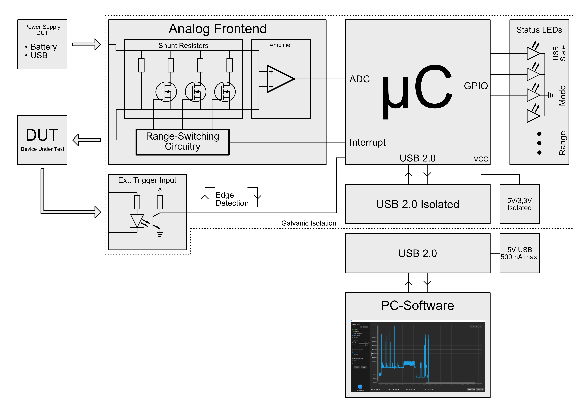
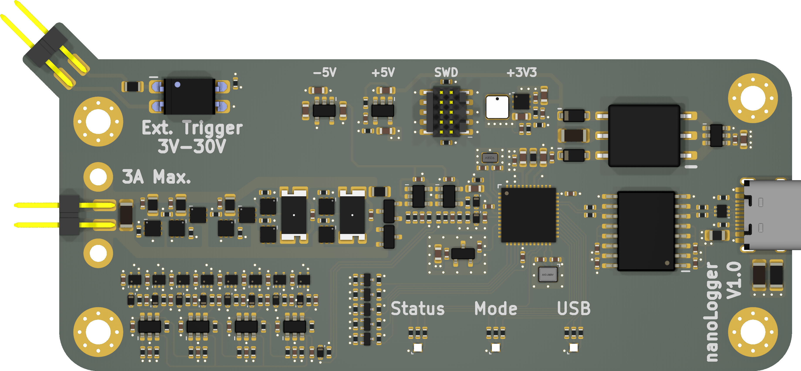

# Block Diagram

Here is a simplified block diagram of the data logger. To measure the current of a device, the data logger is simply connected in series between the voltage source and the DUT/load.

The current flow creates a small voltage drop across the selected shunt resistor, which is amplified by a factor of 100. The output voltage is then measured by the microcontroller's internal ADC.
A change of the current range is also observed by the microcontroller, to correctly convert the measured current.

An external trigger signal can optionally be connected. This allows to start the measurement on a rising or falling edge. Perfect to always have the same starting point of a measurement, for example when the DUT enters active mode.

Status LEDs provide the user with information about the device's current state/mode, for example: logger in standby mode, or data recording in progress.

The captured data is buffered internally in the microcontroller and then transferred to a PC via an isolated USB 2.0 interface.

# Hardware

I've written a very detailed explanation as part of the project documentation. You can read more about it [here](docs/Technikerarbeit_Tobias_Netzer.pdf) if you are interested in the design aspects and my thoughts behind them. This is also where you can find all the schematics and technical drawings. The documentation was however written in German.

